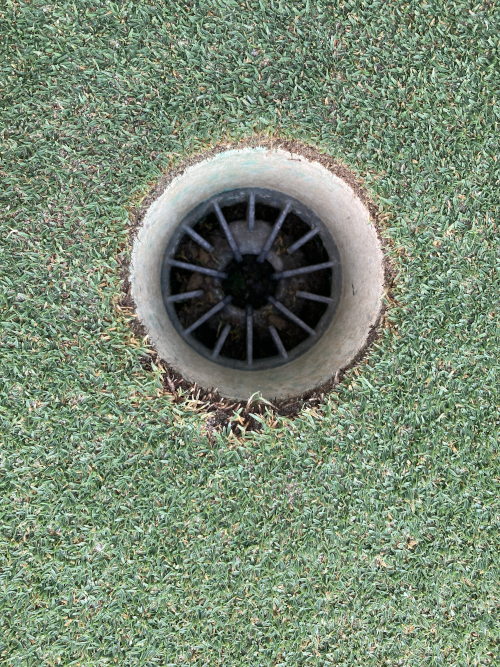

Reading the Grain on a Golf Course Green:  A Machine-Learning Challenge

I have spent more than twenty years cutting cups on golf course greens.  Like a lot of other people, I have observed that one side of a golf cup is usually more ‘distressed’ than the other.  An example is shown below.

    

The conventional wisdom is that this phenomenon is not due to poor technique on the part of the cup cutter but due to the grain of the grass in the vicinity of the hole.  In fact, serious golfers will often look for the distressed edge of a cup and adjust their putting stroke accordingly. 

The objective of this project is to assemble a large collection of pictures of golf course holes and to classify them according to the uneven wear around their perimeters, ultimately using that classification as a way to develop a machine learning algorithm to call grain on a golf course green.  Contributions of code and images are both welcome!

