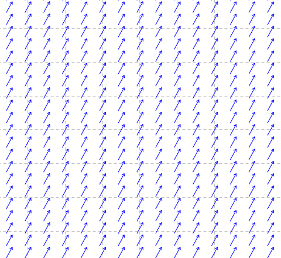

Reading the Grain on a Golf Course Green:  A Machine-Learning Challenge

I have spent more than twenty years cutting cups on golf course greens.  Like a lot of other people, I have observed that one side of a golf cup is oftentimes more ‘distressed’ than the other.  An example is shown below.

    

The conventional wisdom is that this phenomenon is not due to poor technique on the part of the cup cutter but due to the grain of the grass in the vicinity of the hole.  In fact, serious golfers will often look for the distressed edge of a cup and adjust their putting stroke accordingly. 

The objective of this project is to assemble a large collection of pictures of golf course holes and to classify them according to the uneven wear around their perimeters, ultimately using that classification as a way to develop a machine learning algorithm to call grain on a golf course green.  Contributions of code and images are both welcome! 

Why do the edges of the cup reveal grain?  Nobody knows for sure.  But here's a theory.  Grass planted on golf course greens is usually stoloniferous.  That is, the grass grows by sending out stems or stolons that run horizontally just below the surface of the ground.  At certain intervals, these stolons decide to send down vertical roots and simultaneously pop out a new tuft of grass.  These secondary tufts or ramets then, in turn, send out stolons and the process repeats itself over and over again.  These horizontal stolons are what you feel when you rub a green trying to discern its nap or grain.  More precisely perhaps, it is the above-ground manifestation of the underlying network of stolons you discern when you vigorously rub a green.  Anyway, suppose the stolons in a given patch of green decide to grow in the same direction.  Let's say the stolons are responding to a long-standing nutrient gradient of some sort.  Or the mowers are consistently hitting them just so and they are growing in concert as a result.  It doesn't really matter: just suppose they are growing in the same direction. I can draw the situation like so, where the blue arrows indicate individual stolons:

  

Here, I draw the stolons with arrow-heads to reflect the fact they have a polarity. The mother tuft is the oldest and has the longest roots.  The daughter ramets are progressively younger and correspondingly less strongly rooted.  In fact, the terminal tuft is rootless and freely suspended in the thatch trying to decide where to touch down next.  In the diagram, suppose the terminal tufts are the arrow-heads.  So, when a cup cutter cuts a hole, he does something like so:

    

  

